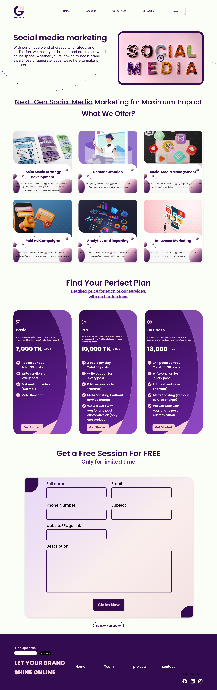

Here's the updated version of the README file, including the option for a live link and website preview image:

---

# Nexgenix - Google Ads Management Website

Welcome to the **Nexgenix** project! This is a website designed to provide expert Google Ads management services. It maximizes online visibility for businesses by offering a series of carefully crafted ad campaigns and robust targeting strategies. The website is built using HTML, CSS, Tailwind CSS, and DaisyUI.

## Table of Contents
- [Overview](#overview)
- [Features](#features)
- [Installation](#installation)
- [Usage](#usage)
- [Technologies Used](#technologies-used)
- [Contributing](#contributing)
- [License](#license)
- [Live Link](#live-link)
- [Website Preview](#website-preview)

## Overview

**Nexgenix** helps businesses leverage the power of Google Ads to reach their target audience and maximize their advertising ROI. This project aims to guide potential clients through a series of proven steps to ensure the success of their Google Ads campaigns. The website features:
- A modern and responsive design.
- An informative homepage introducing the core services.
- Detailed sections for the Google Ads process, targeting strategies, and expert features.
- A form for clients to request a free website audit.
- Integration with Tailwind CSS and DaisyUI for sleek, responsive components.

## Live Link

You can access the live version of the website here:  
[Live Website Link](https://ahammad204.github.io/nexgenix/)
[Alternative Website Link](https://nexgenix.netlify.app/)

## Website Preview

Here is a preview of the website:




## Features

1. **Home Page**: 
   - Brief introduction to the Google Ads services.
   - A banner showcasing the benefits of Google Ads.
   
2. **Proven Process**:
   - Describes the step-by-step process of managing Google Ads for clients.

3. **Targeting**:
   - An in-depth look at how Nexgenix uses advanced targeting strategies for ads.
   
4. **Expert Features**:
   - Features related to optimization techniques, campaign insights, and budget management.

5. **Free Website Audit Form**:
   - Form where clients can request a free audit of their websites.

6. **Subscription Form**:
   - Users can subscribe to receive updates about Google Ads and Nexgenix services.

7. **Footer**:
   - Contains navigation links to pages like Home, Team, Projects, and Contact.
   - Social media links to Facebook, LinkedIn, and Instagram.

## Installation

To run the project locally, follow these steps:

1. **Clone the repository**:
    ```bash
    git clone https://github.com/yourusername/nexgenix.git
    ```

2. **Navigate to the project directory**:
    ```bash
    cd nexgenix
    ```

3. **Open the `index.html` file in your browser**:
    - Simply open the `index.html` file in any browser to view the project.

4. **Optional**: If you want to customize or develop further, you can set up a local development server like [VS Code Live Server](https://marketplace.visualstudio.com/items?itemName=ritwickdey.LiveServer) for easier viewing.

## Usage

Once the website is running, users can navigate through different sections to learn more about the services offered by Nexgenix. The homepage introduces the website, while other sections guide users through the Google Ads process, targeting, and features. Clients can request a free audit or subscribe for updates.

## Technologies Used

- **HTML5** - For structuring the content.
- **CSS3** - For styling the web pages.
- **Tailwind CSS** - A utility-first CSS framework used for styling.
- **DaisyUI** - A component library that works seamlessly with Tailwind CSS to provide pre-designed UI components.

## Contributing

1. **Fork the repository**.
2. **Clone your fork**:
    ```bash
    git clone https://github.com/yourusername/nexgenix.git
    ```
3. **Create a branch**:
    ```bash
    git checkout -b feature-name
    ```
4. **Make your changes**.
5. **Commit your changes**:
    ```bash
    git commit -m "Added feature"
    ```
6. **Push to your branch**:
    ```bash
    git push origin feature-name
    ```
7. **Create a pull request**.

## License


